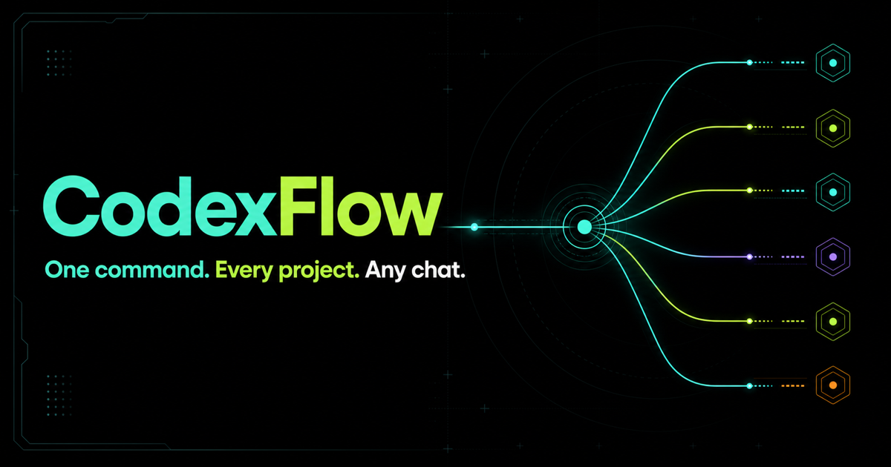

<p align="center">
  <a href="https://tarunspandit.github.io/codexflow/zh.html"></a>
</p>

<h1 align="center">CodexFlow</h1>

<p align="center">
  让 ChatGPT Web 看见你的本地仓库，并像本地代码代理一样工作。
</p>

<p align="center">
  <a href="https://www.npmjs.com/package/@tarunspandit/codexflow"></a>
  <a href="https://github.com/tarunspandit/codexflow/actions"></a>
  <a href="https://github.com/tarunspandit/codexflow/blob/main/LICENSE"></a>
</p>

CodexFlow 是独立开源项目，与 OpenAI 没有隶属、合作、赞助或官方背书关系。文中提到 Codex、ChatGPT 和 OpenAI 仅用于说明兼容性；相关名称和商标归其各自权利人所有。

<p align="center">
  <a href="README.md">English</a>
  ·
  <a href="https://github.com/tarunspandit/codexflow">GitHub 点星</a>
  ·
  <a href="https://www.npmjs.com/package/@tarunspandit/codexflow">npm</a>
  ·
  <a href="DOMAIN_SETUP.md">稳定 URL 指南</a>
  ·
  <a href="FAQ_ZH.md">中文 FAQ</a>
  ·
  <a href="SECURITY.md">安全说明</a>
</p>

## 安装

codexflow 需要 Node.js 20+，以及能使用 Apps / Developer Mode 的 ChatGPT 账号。OpenAI 当前文档列出的 web 端 Developer Mode 账号范围包括 Pro、Plus、Business、Enterprise 和 Education。

> **模型兼容性：**请使用 Extra High 或其他非 Pro 模型。ChatGPT 的 Pro
> 模型变体不会开放 Apps，但 Pro 订阅仍可通过受支持模型使用 Apps。如果
> 回复中没有 CodexFlow，请切换模型，不要重启本地 broker。

> **新聊天：**`+` 菜单最先显示的是排序后的推荐项，并不是完整插件列表。
> 请选择 `+` → More，再搜索 `CodexFlow`。同一个插件可以同时用于多个聊天；
> 每个聊天都会通过共享 broker 获得独立的私有项目路由。

先安装 CLI：

```bash
npm install -g @tarunspandit/codexflow
```

GitHub `main` 文档可能早于 npm 发布；用 `npm install -g @tarunspandit/codexflow` 前请看 npm badge/version，未发布的 `main` 行为请用下面的 source checkout 方式。

然后在任何目录运行唯一的启动命令：

```bash
codexflow
```

codexflow 会从本机 Codex metadata 自动发现所有项目，启动 broker 和 Cloudflare tunnel，安装并打开原生 macOS 应用，同时复制 ChatGPT Server URL。先到 `Settings -> Security and login` 打开 Developer mode，再到 `Settings -> Plugins` 创建连接，粘贴这个 URL，并选择 `Authentication: No Authentication / None`。

codexflow 把 ChatGPT Developer Mode 变成本地仓库的 MCP 代码代理。ChatGPT 可以读取文件、搜索代码、查看 git 状态、写入或精确编辑文件，并运行安全范围内的验证命令。

codexflow 不是速率限制绕过工具。它不会绕过、提升、合并、转售或修改 ChatGPT、Codex、OpenAI 或第三方模型的限制。它只是通过官方 Developer Mode / MCP App 路径，把你自己的 ChatGPT 会话连接到你自己的本地仓库。

如果 Codex 当前工作流暂时不可用，而你的 ChatGPT 页面仍然可用，CodexFlow 可以让你继续在同一个本地仓库上工作。反过来也一样：ChatGPT 负责高上下文规划，Codex、OpenCode、Pi 或其他本地执行器负责终端里的实际执行。

## 适合谁

codexflow 适合已经有 ChatGPT Apps / Developer Mode 权限并希望做本地开发的人：

- 想让 ChatGPT Web 直接读取本地代码，而不是反复复制文件片段。
- 想把 `AGENTS.md`、`.ai-bridge`、git diff、源码文件这些 Codex 风格上下文给 ChatGPT。
- 想在 ChatGPT 里完成规划、审查、改小文件、跑安全验证。
- 想在某些模型不能调用工具时，导出一个持久上下文包给它做规划。
- 想把 ChatGPT 的计划交给 Codex、OpenCode、Pi 或自定义本地代理执行。

当前测试显示，ChatGPT Free / Go 账号不暴露 CodexFlow 需要的 Apps / Developer Mode 创建流程。请使用 ChatGPT 中能看到 Apps / Developer Mode 的账号层级。

## 它能做什么

```text
ChatGPT Web 可以看到：
  AGENTS.md
  .ai-bridge 计划、状态和执行记录
  git status
  show_changes 审查摘要和可选 diff
  文件树、搜索结果、指定源码文件

ChatGPT Web 可以操作：
  read    读取文件
  search  搜索代码
  write   在工作区内写文件
  edit    精确替换文本
  bash    运行安全验证命令
  terminal 维持每个聊天自己的交互式/后台进程
  local_environment 使用共享的本地环境配置和 actions
  worktree 创建隔离 checkout 并安全交接改动
  prepare_scheduled_task 为 ChatGPT Scheduled 准备可靠的本地项目运行提示
  show_changes 查看当前改动摘要

本地执行器仍然有价值：
  Codex / OpenCode / Pi 执行计划
  终端重任务留在本地
  ChatGPT 回看执行结果和 diff
```

默认 `CODEXFLOW_TOOL_MODE=standard`，只暴露常用编码循环、`codexflow_self_test`、`show_changes`、上下文导出和 handoff。演示时可以用 `--tool-mode minimal`，需要完整兼容工具时用 `--tool-mode full`。

默认工具数量较少是故意的：ChatGPT 面对少量高信号工具时更稳定。workspace open 默认不做 skill discovery；需要 repo-local skills 时传 `include_skills=true`，需要 user/plugin skills 时再加 `include_global_skills=true`。然后用 `load_skill` 按名称、source 和显示出的 path 加载需要的 `SKILL.md`；如果仍有重名匹配，CodexFlow 会报歧义错误，不会随便选一个，也不会把几十个 skill 变成单独 action。

codexflow 默认给 ChatGPT 暴露纯 MCP 工具描述，并提供一个小型项目选择器。选择器不是前置条件：如果客户端无法渲染，直接回复准确项目名称即可通过同一个 `select_project` 工具完成路由。需要额外紧凑 v12 结果卡片时，用 `CODEXFLOW_TOOL_CARDS=1` 启动。`CODEXFLOW_WIDGET_DOMAIN` 默认留空并使用 ChatGPT 的隔离 sandbox；正式提交 app 时才应设置为该 App 独有的 HTTPS origin。

## 原生桌面应用

在 macOS 14 或更新版本，第一次运行 `codexflow` 会把随包发布的原生应用安装到 `~/Applications` 并自动打开。之后即使 broker 尚未运行，也可以在 CodexFlow 终端按 `o`，或从另一个终端运行：

```bash
codexflow app
```

这不是第二个聊天或模型客户端；对话仍然属于 ChatGPT。桌面应用直接观察和控制同一个本地 broker，不调用 Codex CLI，也不增加第二套执行后端。它包含：

- **当前**：连接健康、项目数量、活跃聊天和最近活动。
- **项目**：CodexFlow 自动发现的文件夹。
- **环境**：读取与 Codex 桌面应用相同的 `.codex/environments/*.toml`，执行 setup、cleanup 和命名 actions。
- **Worktrees**：创建、检查、显示和安全删除隔离 checkout。
- **聊天**：真正使用工具的当前与最近关闭对话各自路由到哪个项目；后台 discovery 与组件请求不会伪装成聊天。
- **连接**：只在明确操作时复制私有 Server URL，并管理 broker 的启动、停止和重启。
- **策略**：本次进程真正生效的写入、终端、工具、history、认证和 allowed-root 边界。

应用可在 broker 离线时选择工作区并启动它，也可在多个近期或活跃的 workspace runtime 之间切换。旧的 token 保护浏览器页面只保留为紧急恢复和诊断入口；它会优先打开桌面应用，不再复制完整产品界面。

会话遥测只存在于进程内存中，有数量上限，并会在会话关闭后很快过期。它只保存不可操作的显示指纹、已选项目、工具名称、结果和耗时；不会保存 prompts、工具 arguments、文件内容、命令输出、tokens 或可用的 MCP transport IDs。

### 共享本地环境

CodexFlow 直接读取项目中 version-1 `.codex/environments/*.toml`。setup、cleanup、平台专用脚本和命名 actions 都可在 ChatGPT 或原生应用中使用。创建受管 worktree 时，选定环境会自动运行 setup，并提供 `CODEX_SOURCE_TREE_PATH` 与 `CODEX_WORKTREE_PATH`。需要复制到 worktree 的 gitignored 本地文件可写入 `.worktreeinclude`。

这些脚本属于受信任的项目代码，只会在 workspace 写入和 shell 执行都启用时运行。CodexFlow 共享的是格式和项目配置，不会启动 Codex CLI。

### 定时项目任务

ChatGPT Web 负责 schedule、模型、cadence 与运行历史。需要定时处理本地项目时，让 ChatGPT 使用 CodexFlow 并创建 Scheduled task。`prepare_scheduled_task` 会生成稳定提示：每次运行重新获得私有 route，以稳定 project ID 选择项目，恢复本地环境，并可默认创建干净的受管 worktree。

默认提示会执行聚焦验证、调用 `show_changes`、保留 worktree 供审查，并禁止 push/publish。电脑需要保持唤醒，CodexFlow broker 必须运行，Plugin URL 必须稳定。CodexFlow 不会创建本地 cron、不调用 Codex，也不会自己运行模型。

## 其他启动方式

不想全局安装时，也可以用：

```bash
npx codexflow@latest --root /absolute/path/to/your/repo
```

但普通用户更推荐全局安装，这样唯一的启动命令就是 `codexflow`。

## ChatGPT 中的 App 设置

先在 ChatGPT 打开 Developer Mode：

```text
ChatGPT Settings
-> Security and login
-> Developer mode: on
-> Enforce CSP in developer mode: on

ChatGPT Settings
-> Plugins
-> Create
```

保留 CSP 开启。CodexFlow 的卡片和小组件就是按 CSP 开启的路径设计的，不需要远程脚本、外部字体、iframe 或第三方图片。

在创建 Plugin 页面填写：

```text
Name: CodexFlow
Description: Local workspace bridge for ChatGPT coding
Connection: Server URL
Server URL: 粘贴 CodexFlow 自动复制的 URL
Authentication: No Authentication / None
```

复制的 Server URL 已经包含私有 `codexflow_token`。不要单独粘贴 token，除非你的 ChatGPT UI 明确支持自定义 header。

保持终端里的 CodexFlow 进程运行。你停止它之后，ChatGPT 就无法继续连接本地仓库。Cloudflare quick tunnel 的 URL 也会失效。

## 三种主要模式

### 1. Normal coding

默认模式。ChatGPT 可以在工作区内读取、搜索、写入、精确编辑文件，并运行安全验证命令。

```bash
codexflow
```

适合小改动、文档更新、定位 bug、查看 diff、跑 lint/test/build。

如果你正在另一个 Codex 会话里工作，不希望 ChatGPT 触发任何 shell 命令，用：

```bash
codexflow --no-bash
```

如果想保留 bash，但要求 ChatGPT 明确命中你启动的这个 CodexFlow 终端会话标签，用：

```bash
codexflow --bash-session main --require-bash-session
```

开启后，`bash` 工具调用必须带上 `session_id: "main"` 才会执行。

### 2. Handoff

规划模式。ChatGPT 不直接写源码，只写入：

```text
.ai-bridge/current-plan.md
```

然后你在本地终端决定是否执行：

```bash
codexflow execute-handoff --agent opencode --model provider/model --dry-run
codexflow execute-handoff --agent opencode --model provider/model
```

也可以启动监听器，让本地终端在计划变更后执行：

```bash
codexflow --mode handoff
codexflow --mode handoff --no-bash
codexflow watch-handoff --agent opencode --model provider/model --yes
```

执行结果会写回：

```text
.ai-bridge/agent-status.md
.ai-bridge/implementation-diff.patch
.ai-bridge/execution-log.jsonl
```

然后让 ChatGPT 通过 `read_handoff` 或 `codex_context` 审查结果。

### 3. Pro context fallback

有些 ChatGPT 模型或产品界面不能直接调用 Developer Mode Apps、连接器或 MCP 工具。即使同一个符合条件的账号可以创建 CodexFlow app，某个具体模型界面仍然可能没有工具调用能力。

这时不要强行让它调用工具。先导出一个持久上下文包：

```bash
codexflow pro-bundle --root /absolute/path/to/your/repo --copy
```

它会写入：

```text
.ai-bridge/pro-context.md
```

把这个上下文粘贴给不能调用工具的模型，让它产出窄范围实现计划。然后保存计划并应用：

```bash
codexflow pro-apply --root /absolute/path/to/your/repo --file plan.md
```

这会写入 `.ai-bridge/current-plan.md`，再交给 Codex、OpenCode、Pi 或自定义本地代理执行。

如果你的 ChatGPT 账号已经在 Web 产品里提供 GPT-5.5 或更强模型，并且该模型界面可以调用 Developer Mode Apps，CodexFlow 可以让它通过 MCP 使用本地仓库工具。CodexFlow 不提供、不代理、不转售、也不解锁模型。

## 稳定 URL 怎么选

ChatGPT App 需要一个可访问的 Server URL。你有三个常用选择：

```text
Cloudflare quick tunnel   最快演示路径。每次重启 URL 都变。
ngrok free dev domain     推荐给大多数用户。免费账号给一个稳定 dev domain。
Cloudflare named tunnel   适合已有自定义域名的用户。
```

### Cloudflare quick tunnel

最适合录 demo 或临时试用：

```bash
codexflow
```

缺点很明确：quick tunnel 的 URL 每次重启都会变。如果你把 quick URL 放进 ChatGPT App，下一次启动时需要重新编辑 ChatGPT App 的 Server URL。

### ngrok free dev domain

推荐给大多数用户。创建一个免费 ngrok 账号，在 ngrok Dashboard 的 Universal Gateway -> Domains 找到你的 dev domain，比如：

```text
your-name.ngrok-free.dev
```

一次性认证 ngrok：

```bash
ngrok config add-authtoken YOUR_NGROK_TOKEN
```

保存到 CodexFlow：

```bash
codexflow settings set --tunnel ngrok --hostname your-name.ngrok-free.dev
```

以后启动：

```bash
codexflow
```

ChatGPT 里的 Server URL 可以保持不变。

### Cloudflare named tunnel

如果你有自己的域名，可以用 Cloudflare named tunnel：

```bash
cloudflared tunnel login
cloudflared tunnel create CodexFlow
cloudflared tunnel route dns CodexFlow codexflow.example.com
```

之后日常启动：

```bash
codexflow stable --hostname codexflow.example.com --tunnel-name codexflow
```

更多域名细节见 [DOMAIN_SETUP.md](DOMAIN_SETUP.md)。

## Codex 风格上下文

codexflow 不读取 Codex 的隐藏运行时记忆。它给 ChatGPT 的是显式工作区上下文：

```text
open_current_workspace  当前 root、安全模式、AGENTS 状态、git 状态
codex_context           AGENTS 链、.ai-bridge 文件、可选 git status/diff
read_handoff            只读 .ai-bridge 文件
workspace_snapshot      更大的项目快照和 handoff 上下文
```

`codex_context` 会读取从仓库根目录到目标路径上的指令文件：

```text
AGENTS.override.md
AGENTS.md
agents.md
.agents.md
```

并加入：

```text
.ai-bridge/current-plan.md
.ai-bridge/agent-status.md
.ai-bridge/implementation-diff.patch
.ai-bridge/codex-status.md
.ai-bridge/decisions.md
.ai-bridge/open-questions.md
.ai-bridge/execution-log.jsonl
git status
可选 git diff
```

推荐流程：

```text
先调用 server_config 和 codexflow_self_test
如果 self-test 失败，先停下来报告失败项
先调用 open_current_workspace，include_tree=false
再调用 codex_context，target_path 指向要改的文件，include_diff=false
然后只读取当前任务需要的文件
```

这样 ChatGPT 会更接近 Codex 的指令模型，同时不会依赖隐藏状态或大范围重复扫描。

## 安全边界

codexflow 是本地开发桥，不是操作系统级沙箱。

默认安全行为：

- 公网 tunnel 默认需要私有 CodexFlow token。
- 写入限制在配置的工作区 root 内。
- 常见敏感路径会被拒绝：`.env`、私钥、`.git`、`node_modules`、生成目录、缓存目录。
- symlink 逃逸会被阻止。
- safe bash 只允许常见检查、搜索、git、lint、test、typecheck、build 等命令。
- 本地环境脚本被视为受信任的项目代码，必须显式启用 workspace 写入与 shell 执行。
- `codexflow --no-bash` 会完全关闭 ChatGPT 可调用的 bash 工具。
- `execute-handoff` 和 `watch-handoff` 是本地 CLI 命令，不是远程 MCP 工具。

只有在你信任当前仓库和命令时，才考虑更宽的权限，例如 full bash、自定义执行器、额外 allow root。

### Codex 会话边界

codexflow 的 MCP transport session id 不代表 Codex 聊天。CodexFlow 不会启动或恢复 Codex CLI；ChatGPT 提供模型，CodexFlow 提供本地文件、git、terminal、仓库规则和 skill 工具。

`bash` 工具属于你启动的 CodexFlow 本地服务器进程，并在当前聊天选中的项目目录下运行。并行任务可以通过同一个 broker/tunnel 在不同聊天中选择不同项目；这不是“远程控制当前 Codex 会话”。

如果要减少误触发，可以给这个本地 CodexFlow 进程设置 bash session guard：

```bash
codexflow --bash-session main --require-bash-session
```

这不是 Codex App 聊天会话 id，而是 CodexFlow 本地 bash 工具的显式匹配标签。

bash 结果默认使用紧凑 transcript，避免 ChatGPT 对话里突然铺开大段 stdout/stderr。完整 stdout/stderr 仍在结构化工具数据里，CodexFlow 卡片里的输出预览默认折叠。需要旧行为时可以显式打开：

```bash
codexflow --bash-transcript full
```

codexflow 也可以在 full tools 下显式开启只读的本地 Codex 会话列表：

```bash
codexflow --tool-mode full --codex-sessions metadata
codexflow --tool-mode full --codex-sessions read
```

`metadata` 会增加 `codex_sessions` 工具，从本地历史列出 session；`read` 还会增加有限长度的 transcript 读取。它们只读取历史，不执行 Codex。

一个 broker/tunnel 可以同时服务多个网页聊天：

```bash
codexflow --tool-mode full --root /path/to/default-repo --allow-root /path/to/projects
```

新聊天调用 `list_projects` 后会显示项目选择器。目录来源包括默认项目、allowed roots 下发现的项目，以及本机 Codex metadata 中最近使用且仍在 allowed roots 内的目录。`select_project` 会把当前 ChatGPT MCP 会话绑定到所选目录；之后不传 `workspace_id` 的文件、git、搜索、编辑和 terminal 调用都会自动路由到该项目。其他网页聊天拥有独立绑定。选择项目时也会发布 repo 指令、workspace/user/plugin skills 和已配置 MCP server 名称。

如果 Codex 历史不在默认位置，可以用 `--codex-dir <dir>`。

如果只想让 ChatGPT 规划、由你本地决定是否执行：

```bash
codexflow --mode handoff --no-bash
```

## 常用命令

```bash
codexflow
codexflow --non-interactive
codexflow status
codexflow status --json
codexflow app
codexflow doctor
codexflow settings
codexflow settings list
codexflow settings set --tunnel ngrok --hostname your-name.ngrok-free.dev
codexflow settings delete --yes
codexflow pro-bundle --copy
codexflow execute-handoff --agent opencode --model provider/model --dry-run
codexflow watch-handoff --agent opencode --model provider/model --yes
```

终端控制键：

```text
Enter  打开 ChatGPT connector 设置
c      再次复制 Server URL
o      打开原生 CodexFlow 应用
h      显示帮助
q      停止 CodexFlow
```

在脚本、CI 或没有交互式终端的环境中，使用 `--non-interactive`。连接器会继续运行，直到收到 SIGINT/SIGTERM；`codexflow status --json` 可用于自动化检查。

原生应用是主要控制界面：它显示当前 workspace、连接状态、项目、聊天路由、策略边界和不含内容的活动；也可以选择 workspace、启动/停止/restart broker、复制私有连接 URL，以及保存下次启动的高级策略。Token 永远不会显示或写入日志。

带 token 保护的浏览器页面只是紧急 fallback：它用于打开桌面应用、复制连接 URL 和查看最少量诊断，不再承担 setup/settings dashboard 的职责。Cloudflare dashboard-managed tunnel 的 token 仍应保存在本地文件中，而不是粘贴到任何 UI。

## FAQ

中文常见问题见 [FAQ_ZH.md](FAQ_ZH.md)。

核心结论：

- 需要能访问 Apps / Developer Mode 的 ChatGPT 账号。
- Free / Go 在当前测试中不支持这个 App 创建流程。
- CodexFlow 不绕过任何速率限制。
- 某些 Pro / planning 模型界面不能直接连接 MCP 工具，使用 `pro-bundle` 作为上下文回退。
- quick tunnel 每次重启 URL 会变。
- 想每天同一个 URL，用 ngrok free dev domain 或 Cloudflare named tunnel。

## 开源与贡献

项目地址：[github.com/tarunspandit/codexflow](https://github.com/tarunspandit/codexflow)

欢迎提 issue、补文档、补平台兼容性、补测试。提交 PR 前请至少运行：

```bash
npm run build
npm run smoke
npm audit --omit=dev
```

如果 CodexFlow 对你有用，请在 GitHub 点星。这样其他使用 ChatGPT、Codex、OpenCode、Pi 和 MCP 的开发者更容易找到它。
